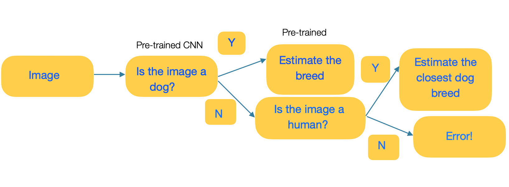

# Dog Breed Classification

This is the Capstone project done as part of Udacity's AWS Machine Learning Nanodegree program.
The problem statement is:
Given an image of a dog, estimate and output the dog’s breed. If a human’s image is given, output the dog breed the human resembles.

